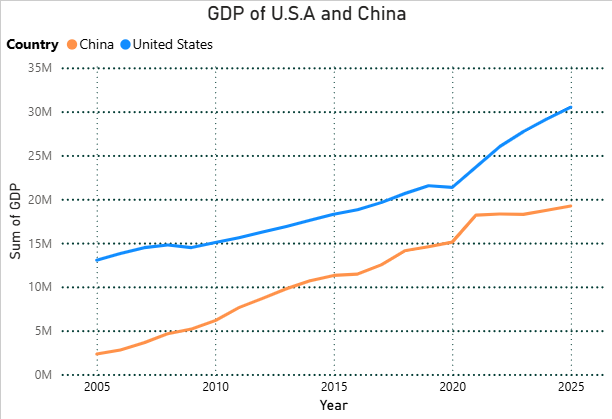

# Forecasting U.S. Economic Stability Using GDP Trends 2005 - 2025
### Executive Summary
This project analyzes whether the United States shows signs of economic slowdown or potential recession by examining key macroeconomic indicators and comparing them with those of China which is a major global economic competitor. Using Python (Pandas) for data cleaning and transformation, and Power BI for visualization, I developed interactive charts that highlight trends like the GDP, unemployment rates, and changes in food and housing prices.
- **Collected and consolidated** GDP, unemployement, and cost-of-living datasets.
- **Cleaned and analyzed** data using Python (Pandas).
- **Visualized trends** in Power BI to identify recession indicators.

### U.S. Possible Issues
Economic uncertainty, rising inflation, and market instability are causing people to be concerned about a potential U.S. financial collapse. To assess this, I used quantitative data to uncover trends that may signal what direction the American economy is headed in comparison to China's consistent growth trajectory.

### Food Tariffs
One major factor that has made the economy extremely unstable is the tariffs placed on goods being imported from other countries. Which has made some prices on certain foods increase like for example, coffee, bananas, and many others. This dataset highlights the overall impact on much food will be impacted, which in turn will make consumers pay a higher price for certain food items. As food prices rise faster than wages, households may experience decreased purchasing power, which amplifies the economic pressures associated with a recession.

